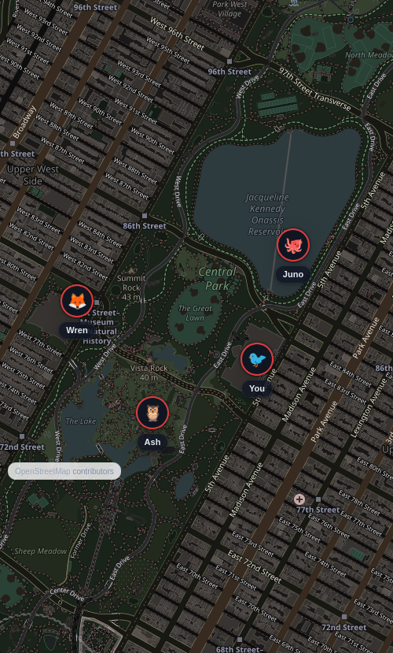
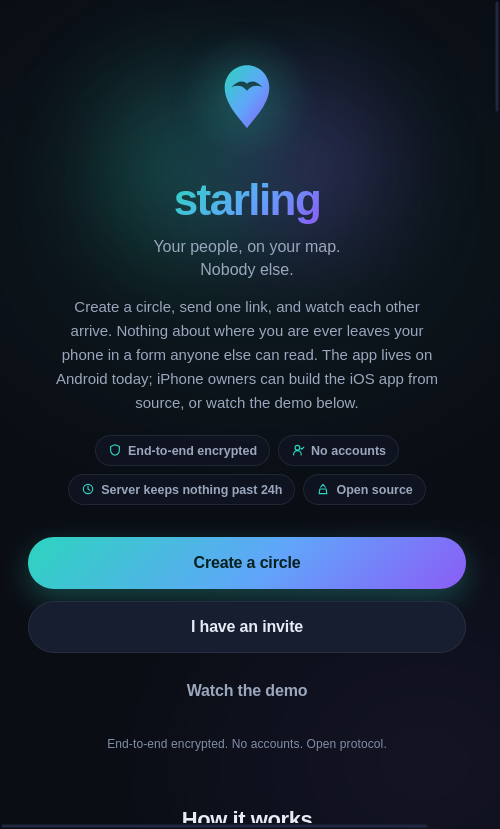
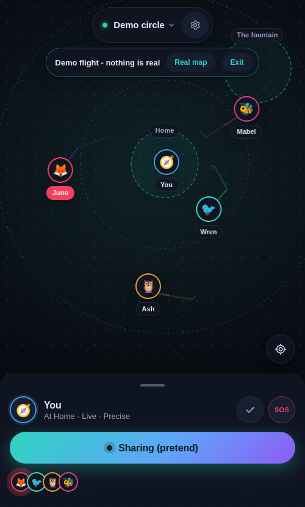
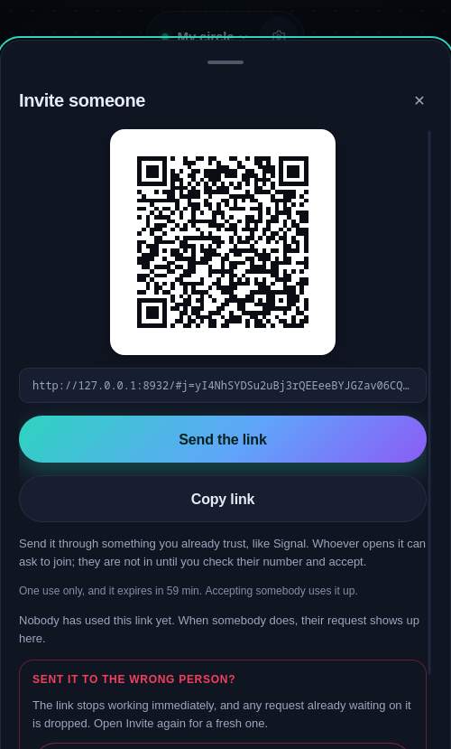
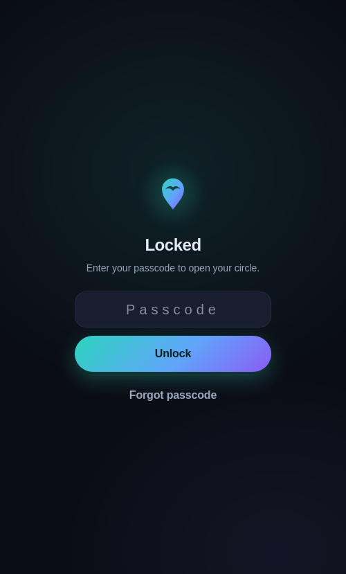

# starling

Private location sharing for friends and family. End to end encrypted, no
accounts, no phone numbers, and a relay that stores nothing it could ever read.

[](https://github.com/munzzyy/starling/actions/workflows/ci.yml)

[](https://f-droid.org/packages/app.starlingmap/)
[](https://tern.munzzyy.dev/add/?url=https%3A%2F%2Fgithub.com%2Fmunzzyy%2Fstarling)

**Live:** [starlingmap.app](https://starlingmap.app) ·
grab the Android app there, from F-Droid, or from the
[releases page](https://github.com/munzzyy/starling/releases).

Life360 works by shipping everyone's location to a company. Starling keeps the
Life360 features people actually want (live map of your people, SOS, check-ins,
battery, invite links) and drops the surveillance: positions are encrypted on
your device with a key the server never sees, and the relay holds at most 24
hours of ciphertext.



Circles are plural. Keep one for family and one for the friends you split up
from at a fair or a concert, and switch between them with a tap on the circle
name. Each circle has its own secret, its own channel, and its own signing
identity, so the relay cannot tell that two circles share a member. The map,
sharing, and invites all follow whichever circle is active.

This document describes protocol v2: forward secrecy, post-compromise
security, and cryptographic member removal. As of 0.5.0 it is wired end to
end, crypto core through relay through storage through UI, on both web and
Android, and 500-plus unit tests plus six end to end suites
exercise it as a running app talking to a running relay. Nobody outside this
project has independently reviewed any of it. See
[docs/AUDIT.md](docs/AUDIT.md) for exactly what has and has not been
checked, including whether the live relay has actually been redeployed to
speak v2 yet.

## How it works

- Creating a circle generates its keys on your device. Inviting someone
  shares a one-time invite secret, in the URL fragment, which browsers never
  send to any server; it is not the circle's own key material, so a stolen
  invite link is only good for one join attempt, and only if you accept a
  safety number you were not expecting. Share the link over something you
  already trust, like Signal, the same as always.
- Locations are AES-256-GCM encrypted under a key that advances every 10
  minutes (HKDF-SHA-256, one hash step forward per epoch) and is destroyed
  the moment a device moves past it. A device seized after it has advanced
  cannot decrypt what it already forgot, and neither can anyone who takes it.
  Names, avatars, and statuses ride inside the ciphertext too. Every
  plaintext is padded to exactly 512 bytes so message sizes carry nothing.
- Each device signs its posts with its own Ed25519 key (P-256 fallback), and
  every receiving device checks that signature itself. The content key
  advances per member as well as per epoch, so it proves only that a message
  came from a key material holder; the signature is what says which member.
  The relay pins each key on first write, so nobody can overwrite your slot,
  and a strictly increasing (epoch, timestamp) rule kills replays, checked by
  every receiver, not just the relay.
- Removing someone from a circle re-keys it: a fresh chain, mixed with fresh
  key-exchange entropy, delivered to everyone except the member being
  removed. They get no wrap, derive no new keys, and cannot follow the
  circle to its next channel. That is what makes removal complete rather
  than a request the removed device can just ignore.
- The relay is a small Cloudflare Worker with a D1 table of ciphertext rows.
  It knows channel ids, ciphertext sizes, timing, and IPs. It never learns
  where you are or who your circle is. Rows expire after 24 hours, swept
  deterministically on every read and write. Cloudflare hosts the default
  relay, so it sees the same IPs and timing. Tor mode in the Android app's
  Settings keeps your IP from both.
- No push tokens, no analytics, no third party requests. The only external
  fetch in the whole app is OpenStreetMap tiles, and only when a street basemap
  is on; the Off-grid basemap renders locally and makes zero requests.
- Optional app lock encrypts the circle secret at rest behind a passcode
  (Argon2id, 64 MiB and three passes, from a reproducible build of the
  reference implementation: [docs/ARGON2.md](docs/ARGON2.md)) and, where
  the browser supports it, a biometric unlock through the WebAuthn PRF
  extension. A locked device holds no
  readable secret in memory or on disk. An optional duress passcode, typed on
  the lock screen, runs the full panic wipe and comes back up as a fresh
  install.
- Places live only on your phone. Name a spot like Home or School and Starling
  says when someone in the circle arrives or leaves; detection runs on-device
  against positions that already arrive, so the relay never learns a place
  exists. SOS, arrival, and low-battery alerts reach the Android app as system
  notifications while it is in the background, built locally, with no push
  service involved.

The exact wire format and crypto are in [docs/PROTOCOL.md](docs/PROTOCOL.md).
What the relay can and cannot learn, stated honestly, is in
[docs/THREAT-MODEL.md](docs/THREAT-MODEL.md). Exactly which of it is wired
into a running app today, file by file, is in [docs/AUDIT.md](docs/AUDIT.md).
If the code and those files ever disagree, that is a bug.

## What it looks like

Dark-first UI. Draggable member sheet, live markers with eased motion, trails,
SOS hold-to-fire, check-ins, coarse mode (your device rounds your position to
about 1 km before encrypting), panic wipe, and a demo you can run without
sharing anything: open starlingmap.app and hit Watch the demo.

An SOS can also mint a help link. Your circle is a list you chose in advance,
and the person who can actually reach you may not be on it, so the link opens
your live position in any browser with no app and no account, for as long as
the emergency lasts. It shows that one emergency: not your circle, not its
other members, not any history. Checking in safe switches it off.

A check-in timer covers the walk home or the meeting with a stranger: pick 30
minutes to 8 hours, and if you have not checked in by then your circle's phones
say so, even if yours is off or gone.

Circles are app-only by design. The hosted website is a landing page plus that
demo; it refuses to create or open circles, because a browser tab is the
weakest place to keep a long-lived location secret (extensions, shared
machines, no OS keystore). The full app still runs on localhost for
development and testing.

| Onboarding | The demo | Invite | App lock |
|---|---|---|---|
|  |  |  |  |

The `test/screenshots/` set is regenerated on every end to end run.

## Sharing model

Sharing is off until you turn it on, and stopping posts a signed goodbye so
your circle sees "stopped" instead of a stale dot. Where the code runs as a
plain page (the iOS build, or a local dev tab) it is live-when-open sharing
like Signal's, not an always-on tracker: when the OS suspends the page,
sharing pauses. That is the honest ceiling of the web platform, and the app
says so instead of pretending otherwise.

The Android app goes as far past that ceiling as it can. A share runs in a
foreground service typed for location, so a backgrounded app or a dark screen
keeps posting. Swiping the app out of recents still ends the share, because the
code that seals each position lives in the page and a torn-down process holds no
keys, and the service stops rather than sit there looking alive with nothing
going out. Since 0.12.0 the app writes down that a share was running and puts it
back when you reopen it, saying so on screen. A share you ended yourself is
never resumed, a timed share that ran out while the app was closed stays ended,
and a locked phone resumes nothing until you unlock it.

Since 0.13.0 there is also a switch, off by default, in Settings under
Sharing: "Keep sharing when the app is closed". With it on, the page is held
by the process instead of the window, so a swipe takes the screen and leaves
the share running. The cost is spelled out in the setting: a phone you think
you closed is still holding your circle's keys, and the app lock cannot cover
them until the share ends.

## Run it

No build step, no dependencies to install. Needs Node 24 or newer.

```
# unit tests (crypto, wire, ratchet, rekey, membership,
# relay, QR, UI logic, lock, circles, manifest, and every committed test vector)
node --test test/*.test.mjs

# local dev server (app + relay on one origin)
node test/serve_local.mjs 8899

# the end to end suites (need a real Firefox, and Chromium for the wrapper one; not run in CI)
python3 test/e2e_marionette.py   # sharing: create, invite, join, cross-visibility, check-in, SOS, help link, stop
python3 test/e2e_v2_ui.py        # safety-number comparison, review/accept, re-key, key-change warning, beacon revocation
python3 test/e2e_lock.py         # the app-lock lifecycle, duress included
python3 test/e2e_places.py       # places: save, arrive, rename, reload; the relay never sees one
node test/e2e_wrapper.mjs        # the app-vs-website split and the demo scene
node test/e2e_share_resume.mjs   # a share comes back after the app is closed and reopened
```

The QR tests cross-check the encoder against the Python `qrcode` library when it
is installed (`pip install qrcode`); without it those checks skip rather than
fail. Run `tools/sync-vendor.sh` first, though: two service-worker checks assert
that every precached path exists on disk, and `app/vendor` is not in the repo.

The e2e suites drive real headless Firefox profiles through the flows named
above, dump the relay database at the end, and assert no name and no
coordinate appears anywhere in it. Run them yourself rather than trust a
claim that they passed on some earlier date; [docs/AUDIT.md](docs/AUDIT.md)
has the exact commands and what each suite covers.

## Deploy

The default relay and the app ship as one Cloudflare Worker with static
assets. With a Cloudflare API token in `CLOUDFLARE_API_TOKEN` (Workers
Scripts, D1, and Account Settings read), one command creates the database,
applies the schema, and deploys:

```
bash relay/deploy.sh
```

It is idempotent, so re-running it just ships the latest code. The hosted page
serves the landing and demo; sharing itself lives in the Android app.
Geolocation needs a secure context, so plain HTTP will not work anywhere.

A Cloudflare account is not required. The relay is plain fetch-in,
fetch-out code over one SQL table, and `relay/server.mjs` runs that same
code under plain Node with a file-backed SQLite database, behind Apache or
nginx on your own VPS or home server. See
[docs/SELF-HOSTING.md](docs/SELF-HOSTING.md).

Redeploying is what actually breaks v1: the relay answers `/api/v1/*` with
`410 Gone` rather than syncing an old client into a channel nobody else is
on. A v1 client cannot be upgraded in place to talk to a v2 relay, because v1
and v2 derive different channel ids from the same circle secret; every
existing circle has to be re-created after a v1-to-v2 relay upgrade. See the
[changelog](CHANGELOG.md) entry for 0.5.0.

The relay's rate limits are two vars in `relay/wrangler.toml`, both per minute:
`RATE_POST_MIN` (writes per channel, default 256) and `RATE_GET_MIN` (requests
per client address, reads and writes, default 240). They are sized so a full
16-member circle sharing normally never meets them, with room for re-key bursts
and movement posting; the arithmetic behind each number is in the comments next
to them. Raise `RATE_GET_MIN` if several circles reach you from one NAT, VPN
exit or Tor circuit, and `RATE_POST_MIN` if a whole circle shares while moving.
Changing them is a var edit and a redeploy, not a code change.

## QR codes

Invite QR codes are generated on-device by a from-scratch byte-mode encoder
(versions 1-10, EC level M, all masks). The test suite proves every matrix
byte-identical to the Python qrcode library across all mask patterns, so the
codes are correct by construction, not by eyeball.

## What it does not do

Being clear about the edges is part of the point.

- **Background sharing is Android only.** The Android app keeps sharing with
  the screen off through a foreground service. The iOS build and a local dev
  tab are live-when-open: when the OS suspends the page, sharing pauses. A
  wake-lock toggle helps while the screen is on.
- **The relay still sees metadata.** It cannot see your position or who you are,
  but it sees IP addresses, timing, and how many members a channel has. On top
  of a VPN or Tor this drops to the exit's IP. Firing an SOS is its own
  correlation signal: the beacon channel and the circle channel update from
  the same IP at the same instant, even though their keys are unlinkable. And
  the beacon viewer page opens on a street map immediately, so each helper's
  browser fetches OpenStreetMap tiles of the emergency's area: the tile host
  sees the helper's IP and that viewport. See the threat model.
- **Forward secrecy is bounded by the history window, not absolute.** Content
  keys advance every 10 minutes and the old key is destroyed; how much trail
  stays readable on a device is a setting (10 minutes to 24 hours), and that
  is the window a compromise can still expose. Post-compromise security comes
  from re-keying, which has to actually happen: nothing detects a compromise
  and re-keys automatically.
- **A circle invite still needs a human to say yes.** It is no longer a
  bearer token: a stolen link is inert until the real joiner uses it, and the
  inviter has to come back online and accept a safety number before any key
  material changes hands. That is a real cost, not a free upgrade: someone
  has to be there to say yes.
- **The served page is still a web page.** If someone poisons the JavaScript at
  the origin, that is fatal for whoever loads it, the same as for any web client
  of any encrypted service. The mitigations are a strict CSP, no third party
  scripts, and, for the one page the hosted site still serves for
  security-relevant work (the beacon viewer), published per-release asset
  hashes that make a targeted swap detectable rather than invisible; see
  [docs/WEB-INTEGRITY.md](docs/WEB-INTEGRITY.md) for exactly what that does
  and does not buy. The structural fix is that circles only exist in the
  apps, which bundle their code and never load any from the network: the
  Android APK, and the iOS wrapper in `ios/` (build-from-source today, see
  [docs/IOS.md](docs/IOS.md)). The hosted site still refuses to open circles
  in any browser tab, on every platform, for the same reason.
- **No independent security review.** The design is documented before the
  code, 500-plus unit tests replay committed test vectors, and two rounds of
  adversarial review plus a cross-model audit have found and fixed real bugs.
  Nobody outside this project has reviewed any of it. See
  [docs/AUDIT.md](docs/AUDIT.md).

## Android

A native Android app is on
[F-Droid](https://f-droid.org/packages/app.starlingmap/), ships with every
[release](https://github.com/munzzyy/starling/releases), and downloads straight
from [starlingmap.app](https://starlingmap.app). F-Droid builds Starling
from source, checks that its build matches the published APK, and then
ships that same developer-signed APK, so all three routes carry one
signature and you can move between them without reinstalling. F-Droid can
trail a new release by a few days. Google Play is in progress and not live.
It runs the same `app/` code
inside a hand-written Kotlin WebView, and adds what the web platform cannot
give it on its own: background sharing through a foreground service (with a
persistent notification the whole time, so it is never silent about what it
is doing), fingerprint or face unlock through the Android Keystore in place
of WebAuthn PRF, a PanicKit responder for panic-button apps like Ripple, and
Orbot support. See [docs/ANDROID.md](docs/ANDROID.md) for building it,
[docs/play-listing.md](docs/play-listing.md) for the Play Store listing, and
[docs/fdroid/](docs/fdroid) for the F-Droid metadata.

A signed APK ships with every [release](https://github.com/munzzyy/starling/releases),
with a stable `starling.apk` name that [Tern](https://tern.munzzyy.dev) can track. The app has no
Google services dependency at all (plain `LocationManager`, no Firebase, no
push), so it runs as-is on GrapheneOS and other de-googled Android builds;
testing happens on the no-GMS AOSP emulator image for exactly that
reason.

Android 9 works too, with two catches. Google's last security fixes for
Android 9 came out in January 2022, and Android 9 has no "only while using
the app" choice for location, so the location permission there covers all
the time (Starling still only reads your location while you're using it or
sharing). Starling says both once, the first time it opens there. It also
needs Android System WebView 137 or newer, because older versions can't check
the Ed25519 signatures newer phones make, and people in your circle would
quietly stop showing up. A phone that gets updates through Google Play should
already have it; with an older WebView, Starling explains how to update it
instead of opening.

## Privacy policy

[starlingmap.app/privacy](https://starlingmap.app/privacy)

## Roadmap

What is left needs someone other than this repo's code: an outside reviewer,
a native speaker, a store account, or a design decision.

- An independent security review. Nothing else on this list matters as much;
  see [docs/AUDIT.md](docs/AUDIT.md) for where to start. The check-in timer
  is the newest thing to look at: its deadline rides inside every post and
  sits on the phone in plaintext while it runs. The relay's new cap on post
  size is new surface too. So are the bridge methods the Android app gained
  for the share sheet, the bar icons and the share reminder.
- Native-speaker review of the German (#14), French (#15) and Brazilian
  Portuguese (#16) catalogs. They ship as first passes; Spanish went through
  a line by line review (#1) and the other three want the same. The strings
  added since then are first passes in all four, Spanish included. They
  cover the check-in timer and the SOS card, place alerts and the help link
  page, the Do Not Disturb setting, the share reminder with its Android
  notification, and the invite scanner. One file per language in
  `app/js/strings-*.js`, English on the left. The Android notifications
  have their own `strings.xml` per language under `android/app/src/main/res/`.
  More languages are welcome: `node tools/extract-strings.mjs` prints the
  full catalog for a new one, and a test holds every catalog to full
  coverage. RTL layout polish lands with the first RTL translation.
- Google Play, still not live.
- Being visible to more than one circle at once. Precision and cadence are
  per circle now; sharing itself still goes to the active circle only, and
  posting to several means one ratchet, one channel and one outbox each,
  which is a design pass, not an afternoon. It also has to keep the promise
  above that the relay cannot tell two circles share a member: one phone
  posting to two channels on the same beat from one address says exactly
  that, so each circle would need its own schedule, and maybe its own Tor
  circuit.
- One-time guest links as short-lived side circles. A one-way "watch me walk
  home" link could reuse the help link code, but three things need deciding
  first: whether ordinary links on the hosted viewer are fine outside an
  emergency, how loudly the phone has to say one is running so it cannot
  turn into a quiet tracker, and whether it follows neighborhood precision
  and privacy fences, which an SOS ignores on purpose.
- An SOS from the sharing notification or the lock screen, without opening
  the app. That is a lock screen security call, the same kind that makes
  Stop ask for an unlock on Android 12 and up, and a pocket tap that sends a
  real SOS needs a confirm step and a test in a real pocket, not on an
  emulator.
- A real-phone pass over the QR scan. The decoder is proven on rendered and
  distorted codes. The safety number camera path ran on an emulator and the
  invite scan in Chromium with a fake camera. Neither has run on a phone
  camera pointed at another phone. The iOS wrapper has the camera permission
  text but no one has run the scan on iOS.
- A real-phone pass over the alerts that have to reach a phone in a pocket.
  A missed check-in and an SOS that went quiet use the same urgent
  notification as an SOS, and they only fire while Starling can listen in
  the background, which Samsung and Pixel builds police differently. Four
  newer Android behaviors have only run on the stock emulator so far. An
  SOS rings through Do Not Disturb as an alarm. The sharing notification
  comes back after a swipe. Send opens the share sheet. The share reminder
  shows up when it should. The people testing #6 on those phones are the
  right check.

There is an iOS app now: a WKWebView wrapper around the same bundled app,
in `ios/`, that holds a real circle. It is build-from-source only today: a
Mac with Xcode, and a free Apple ID re-signs every 7 days, and background
sharing does not exist on it, because iOS offers no equivalent of the
Android foreground service. [docs/IOS.md](docs/IOS.md) carries the full
capability table and the build steps; TestFlight distribution waits on a
paid developer account. What has not changed: circles still do not belong
in a browser tab on any platform, and the hosted site still refuses to
open them.

## Thanks

- [@Quantum-Future](https://github.com/Quantum-Future) reviewed every line of the
  Spanish translation.
- [@Catalyze4](https://github.com/Catalyze4) and [@KC5YVV](https://github.com/KC5YVV)
  tested "Keep sharing when the app is closed" on their own Pixels and kept
  reporting until it actually worked, which is how 0.13.3 and 0.13.4 happened.

## Questions

Ask in [Discussions](https://github.com/munzzyy/starling/discussions/categories/q-a).
Bugs and feature requests go in [issues](https://github.com/munzzyy/starling/issues),
and security problems go by email, as the
[security policy](https://github.com/munzzyy/starling/security/policy) explains.

## Support

Starling is free and stays free. If you want to help keep it going, you can
sponsor on [GitHub Sponsors](https://github.com/sponsors/munzzyy) or send
Monero to:

```
8BApLkfsBS39oNXz4L1qCmZ7f5zKVRr1qLJgrHddRZb4JRcnjDkcKdk7wW7uThCeV9CuLn8o7gAn8d6vFeWNiyeXSmrRUSq
```

## License

[GPL-3.0-or-later](LICENSE). You can use, study, change and share it. If you
distribute a copy or a modified version, it has to stay under the GPL and
come with its source. Releases up to v0.11.0 were under MIT.

